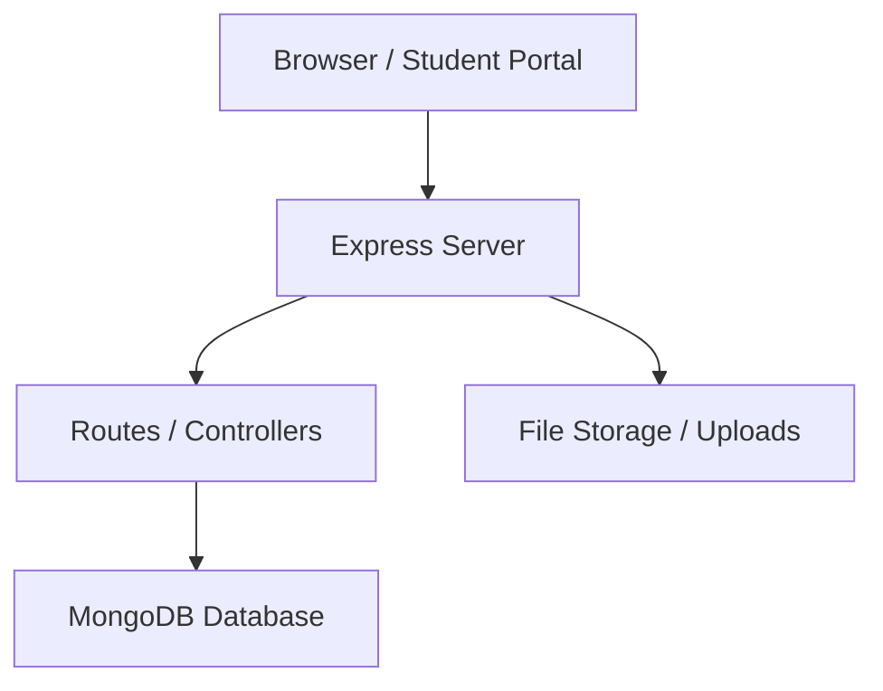
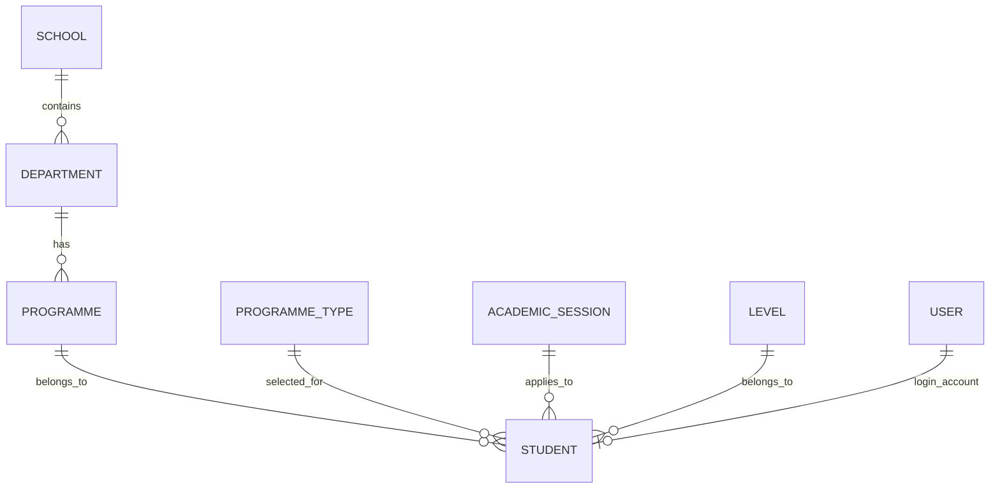

# Student Information Management System

## 1. Project Overview

This project is a full-stack Student Information Management System designed for a school or tertiary institution. It will be implemented using Node.js, Express.js, MongoDB, HTML, CSS, and JavaScript.

The system will support three primary roles:

- Super Administrator: configures the institution, manages admins, and has full system control.
- School Admin / Registry Officer: manages academic setup, adds students, updates records, uploads results, and handles institutional operations.
- Student: logs in to view biodata, register courses, view results, make payments, and receive notifications.

This design follows a real-world institutional workflow rather than a simple single-admin model.

---

## 2. Business Goals

The system should:

- Manage student records efficiently.
- Separate system configuration from day-to-day student operations.
- Support academic setup before student onboarding.
- Provide a secure login experience for each role.
- Offer a portal-style experience similar to a real school management system.
- Be scalable for future features such as results, payments, and notifications.

---

## 3. System Architecture

### 3.1 Tech Stack

- Frontend: HTML, CSS, JavaScript
- Backend: Node.js, Express.js
- Database: MongoDB
- Authentication: Session-based authentication or JWT-based authentication
- File Uploads: Multer
- Environment Configuration: dotenv
- Optional UI Enhancement: Bootstrap or Tailwind CSS

### 3.2 High-Level Architecture



### 3.3 Application Layers

1. Presentation Layer
   - Login pages
   - Admin dashboard
   - Student dashboard
   - CRUD forms and tables

2. Application Layer
   - Route handlers
   - Controllers
   - Middleware for authentication and authorization

3. Data Layer
   - MongoDB collections
   - Mongoose models

---

## 4. Role-Based Access Model

### 4.1 Super Administrator

Responsibilities:

- Create and manage School Admin / Registry accounts
- Configure institution-wide settings
- Manage academic setup data
- View reports and oversee the system

### 4.2 School Admin / Registry Officer

Responsibilities:

- Add, edit, disable, and delete student records
- Manage student biodata
- Upload results
- Register students for courses
- Manage status and account activation

### 4.3 Student

Responsibilities:

- Log in using matric number and password
- View personal biodata
- Upload passport
- Register courses
- View results
- View payments and notifications
- Change password

---

## 5. System Initialization Flow

### Phase 1: First Installation

When the system is first installed:

```text
Student Portal System
    ↓
Database Created
    ↓
Create Super Admin Account
    ↓
System Ready
```

Only one account should exist initially:

- Super Administrator

This account is created manually before the system goes live.

---

## 6. Authentication and Login Flow

### 6.1 Super Admin Login

Route:

- /admin/login

Inputs:

- Username
- Password

If login succeeds:

- Redirect to admin dashboard

### 6.2 School Admin Login

Route:

- /registry/login

### 6.3 Student Login

Route:

- /student/login

Inputs:

- Matric Number
- Temporary Password

---

## 7. Dashboard Structure

### 7.1 Admin Dashboard Layout

```text
--------------------------------------------------------
Header
School Logo
School Name
Current Session
Admin Profile
Logout
--------------------------------------------------------
Sidebar              Main Dashboard
--------------------------------------------------------
Sidebar Menu
Dashboard
Academic Setup
Student Management
Course Management
Course Registration
Results Management
Payment Management
Notification Management
Reports
Settings
Logout
```

### 7.2 Student Dashboard Sidebar

- Dashboard
- Biodata
- Course Registration
- Results
- Payments
- Notifications
- Change Password
- Logout

---

## 8. Academic Setup Module

This module must be completed before student management becomes active.

### 8.1 Schools

Example values:

- Technology
- Engineering
- Science
- Management

Actions:

- Add School
- Edit School
- Delete School

### 8.2 Departments

Each department belongs to one school.

Example:

- School: Technology
- Department: Computer Science

### 8.3 Programmes

Example:

- Department: Computer Science
- Programmes: ND Computer Science, HND Computer Science

### 8.4 Programme Types

Example values:

- CODFEL
- REGULAR
- PART-TIME

These values are selected during student creation.

### 8.5 Levels

Example values:

- ND 1
- ND 2
- HND 1
- HND 2

### 8.6 Academic Sessions

Example values:

- 2023/2024
- 2024/2025
- 2025/2026

One session is marked as current.

### 8.7 Semesters

Example values:

- First Semester
- Second Semester

One semester is marked as active.

---

## 9. Student Management Module

This is the core module of the system.

### 9.1 Student Management Page

The page should include:

- Students
- Search Student
- Add Student
- Import Students
- Export Students
- Student List

### 9.2 Add Student Form

The add student form must contain four sections exactly matching the biodata workflow:

#### Section 1: Academic Information

- Full Name
- Matric Number
- Programme Type
- Academic Session
- School
- Department
- Programme
- Level

#### Section 2: Personal Information

- Sex
- Date of Birth
- Email
- Phone
- Residential Address
- Place of Birth
- State of Origin
- Local Government Area (LGA)

#### Section 3: Parent / Guardian

- Parent / Guardian Name
- Parent / Guardian Address
- Parent / Guardian Phone

#### Section 4: Account Information

- Temporary Password
- Status

Status options:

- Active
- Inactive

No passport upload is required during student creation.

### 9.3 Student Creation Workflow

```text
Create Student
    ↓
Validate all fields
    ↓
Check Matric Number
    ↓
Already Exists?
    ↓
Yes -> Show Error
    ↓
No -> Save Student Record
    ↓
Create Login Account
    ↓
Student Appears In List
    ↓
Success Message
```

### 9.4 Student List Table

Columns:

- Passport
- Full Name
- Matric Number
- Department
- Programme
- Level
- Status
- Actions

Actions:

- View
- Edit
- Disable
- Delete

---

## 10. Student Portal Module

### 10.1 Student Login Credentials

The school provides:

- Matric Number
- Temporary Password

The student logs in at:

- /student/login

### 10.2 Student Dashboard

The student dashboard contains:

- Dashboard
- Biodata
- Course Registration
- Results
- Payments
- Notifications
- Change Password
- Logout

---

## 11. Biodata Module

The biodata page displays all information entered by the school admin.

### 11.1 Biodata Fields

- Full Name
- Matric Number
- Programme Type
- Session
- School
- Department
- Programme
- Level
- Sex
- Date of Birth
- Email
- Phone
- Residential Address
- Place of Birth
- State of Origin
- LGA
- Parent Name
- Parent Address
- Parent Phone

### 11.2 Passport Handling

Initial state:

- No Passport Uploaded
- Upload Passport button

After the student uploads a passport:

- Student Passport
- Change Passport button

### 11.3 Editing Rule

The student cannot edit biodata directly.

Only the school admin or registry officer may update biodata.

---

## 12. Database Design

### 12.1 Collections

#### users

Stores all system users.

Fields:

- _id
- fullName
- username
- email
- passwordHash
- role: super_admin | school_admin | student
- status: active | inactive
- createdAt
- updatedAt

#### schools

Fields:

- _id
- name
- description
- status
- createdAt

#### departments

Fields:

- _id
- schoolId
- name
- status
- createdAt

#### programmes

Fields:

- _id
- departmentId
- name
- status
- createdAt

#### programmeTypes

Fields:

- _id
- name
- status
- createdAt

#### levels

Fields:

- _id
- name
- status
- createdAt

#### academicSessions

Fields:

- _id
- name
- isCurrent
- status
- createdAt

#### semesters

Fields:

- _id
- name
- isActive
- status
- createdAt

#### students

Fields:

- _id
- userId
- fullName
- matricNumber
- programmeTypeId
- academicSessionId
- schoolId
- departmentId
- programmeId
- levelId
- sex
- dateOfBirth
- email
- phone
- residentialAddress
- placeOfBirth
- stateOfOrigin
- lga
- parentName
- parentAddress
- parentPhone
- status
- passportUrl
- createdAt
- updatedAt

#### courses

Fields:

- _id
- code
- title
- departmentId
- levelId
- semesterId
- status
- createdAt

#### courseRegistrations

Fields:

- _id
- studentId
- courseIds
- sessionId
- semesterId
- status
- createdAt

#### results

Fields:

- _id
- studentId
- courseId
- sessionId
- semesterId
- score
- grade
- status
- createdAt

#### payments

Fields:

- _id
- studentId
- referenceNumber
- amount
- paymentType
- status
- createdAt

#### notifications

Fields:

- _id
- recipientType
- recipientId
- title
- message
- isRead
- createdAt

---

## 13. Relationships



---

## 14. Backend Route Structure

### 14.1 Authentication Routes

- GET /login
- POST /login
- GET /logout

### 14.2 Super Admin Routes

- GET /admin/dashboard
- GET /admin/academic-setup
- GET /admin/schools
- GET /admin/departments
- GET /admin/programmes
- GET /admin/programme-types
- GET /admin/levels
- GET /admin/sessions
- GET /admin/semesters
- GET /admin/students
- GET /admin/students/add
- POST /admin/students
- GET /admin/students/:id
- PUT /admin/students/:id
- DELETE /admin/students/:id

### 14.3 School Admin Routes

- GET /registry/dashboard
- GET /registry/students
- POST /registry/students
- PUT /registry/students/:id
- POST /registry/results
- POST /registry/payments

### 14.4 Student Routes

- GET /student/dashboard
- GET /student/biodata
- POST /student/upload-passport
- GET /student/course-registration
- POST /student/course-registration
- GET /student/results
- GET /student/payments
- GET /student/notifications
- POST /student/change-password

---

## 15. User Interface Design Guidelines

### 15.1 Admin UI

The admin interface should be clean, structured, and institutional.

Recommended layout:

- Header with school logo, school name, current session, profile, logout
- Sidebar with grouped modules
- Main content area for dashboards and CRUD tables

### 15.2 Student UI

The student interface should feel simple and portal-like.

Recommended layout:

- Sidebar navigation
- Main content panel for biodata, results, payments, and registration

---

## 16. Security Design

The system should include:

- Password hashing using bcrypt
- Session-based or JWT authentication
- Role-based authorization
- CSRF protection for state-changing forms
- Input validation on all forms
- File upload restrictions for passport images
- Protection against duplicate matric numbers
- Audit logs for critical actions

---

## 17. Non-Functional Requirements

### Performance

- Fast page load for dashboards and student lists
- Efficient database queries for large student records

### Reliability

- Stable creation and update workflows
- Proper validation for duplicate records and invalid data

### Maintainability

- Clear MVC-style folder structure
- Separate routes, controllers, models, and views

### Scalability

- Ready for future modules such as fees, attendance, timetables, and admissions

---

## 18. Suggested Folder Structure

```text
project/
  public/
    css/
    js/
    uploads/
  views/
    admin/
    registry/
    student/
    partials/
  routes/
  controllers/
  models/
  middleware/
  config/
  app.js
  package.json
```

---

## 19. Implementation Phases

### Phase 1: Foundation

- Set up Node.js and Express server
- Connect MongoDB
- Create authentication system
- Create super admin account

### Phase 2: Academic Setup

- Schools
- Departments
- Programmes
- Programme Types
- Levels
- Academic Sessions
- Semesters

### Phase 3: Student Management

- Student forms
- Student listing
- Student creation workflow
- Student status handling
- Temporary password creation

### Phase 4: Student Portal

- Student login
- Biodata page
- Passport upload
- Account password change

### Phase 5: Course Registration and Results

- Course registration
- Result upload by admin
- Student result viewing

### Phase 6: Payments and Notifications

- Payment records
- Notification center
- Reports

---

## 20. Recommended Development Approach

The project should be built in small, testable modules:

1. Build authentication first.
2. Build academic setup before students.
3. Build student registration workflow next.
4. Add student portal pages after the admin flow is stable.
5. Extend gradually with results, payments, and reports.

This preserves the real-world order of operations seen in institutional systems.

---

## 21. Final Blueprint Summary

The system should be designed as a role-based school portal with:

- Super admin for system setup and control
- School admin / registry officer for daily student operations
- Student portal for biodata, courses, results, payments, and notifications

The student management workflow should mirror the biodata entry process described in the brief, while the academic setup must come first to make the application feel realistic and complete.
